# Stock News Backend — ERD (Prototype v1.0)
### 기반 명세: `stock_news_specification.md` v1.2
### 작성일: 2026-04-29

> **프로토타입 범위**:
> - 사용자(`app_user`)는 **조회 전용** — 뉴스 요약, Layer 결과, AI 매매정보를 읽기만 한다.
> - 가상 매매는 **AI 단일 계정** 이 수행. 사용자 가상매매·리더보드는 본 단계에서 제외.
> - 따라서 v1.2 명세 대비 다음 변경:
>   - `virtual_account.owner_type` 컬럼 제거 (AI 고정)
>   - `leaderboard_snapshot` 테이블 **제외**
>   - `app_user` ↔ 매매 테이블 간 관계 없음

총 **18개 테이블** (v1.2 명세 19개 - 리더보드 1개)

---

## 1. 테이블 그룹 분류

| 그룹 | 테이블 |
|---|---|
| **Authentication** | `app_user` |
| **News Ingestion** | `news_source_registry`, `news_raw`, `news_summary`, `news_cluster` |
| **Layer Outputs** | `layer0_prefilter` ~ `layer6_attention` (7개) |
| **Signal & Risk** | `final_trade_signal`, `risk_management_log` |
| **AI Virtual Trading** | `virtual_account`, `virtual_position`, `virtual_trade_log` |
| **Reference / Analytics** | `historical_analog_library`, `backtest_result` |

---

## 2. 전체 ERD (Mermaid)

```mermaid
erDiagram
    %% =======================
    %% Authentication
    %% =======================
    app_user {
        varchar id PK "Google sub"
        varchar email
        varchar nickname
        varchar role "ROLE_USER | ROLE_ADMIN"
        timestamptz created_at
    }

    %% =======================
    %% News Ingestion
    %% =======================
    news_source_registry {
        varchar source_id PK
        varchar name
        varchar base_url
        timestamptz robots_checked_at
        boolean enabled
        int rate_limit_per_min
    }

    news_raw {
        varchar news_id PK
        varchar ticker
        varchar source_id FK
        varchar headline
        text body
        varchar source_url
        varchar news_sentiment
        varchar news_category
        timestamptz published_at
        timestamptz ingested_at
        varchar status "INGESTED|PROCESSED|FAILED"
    }

    news_cluster {
        varchar cluster_id PK
        varchar ticker
        varchar representative_news_id FK
        int member_count
        timestamptz created_at
    }

    news_summary {
        varchar news_id PK,FK
        text body_summary
        decimal summary_score
        varchar category
        jsonb embedding_vector "1536-dim"
        varchar cluster_id FK
        varchar status "OK|FAILED|DEAD"
        timestamptz created_at
    }

    %% =======================
    %% Layer Outputs (각 1:1 with news_raw)
    %% =======================
    layer0_prefilter {
        varchar news_id PK,FK
        decimal news_age_minutes
        varchar duplicate_cluster_id
        boolean is_primary_source
        int duplicate_count_in_cluster
        bigint market_cap_usd
        bigint avg_daily_volume_usd
        boolean is_tradable
        decimal freshness_decay_factor
        timestamptz created_at
    }

    layer1_positioning {
        varchar news_id PK,FK
        decimal vix_term_structure
        decimal put_call_ratio
        decimal short_float_ratio
        decimal days_to_cover
        int fear_greed_composite
        decimal implied_realized_vol_spread
        int normalized_score "0-100"
        timestamptz created_at
    }

    layer2_expectation {
        varchar news_id PK,FK
        decimal eps_revision_trend_30d
        decimal target_price_revision_30d
        int insider_activity_score
        int analyst_rating_delta_30d
        decimal expectation_gap
        int days_to_next_earnings
        int normalized_score "0-100"
        timestamptz created_at
    }

    layer3_event_surprise {
        varchar news_id PK,FK
        decimal surprise_zscore
        decimal historical_analog_return_1d
        decimal historical_winrate
        decimal base_rate_sector
        int sample_size
        int normalized_score "0-100"
        timestamptz created_at
    }

    layer4_microstructure {
        varchar news_id PK,FK
        decimal volume_shock_zscore
        boolean bollinger_squeeze
        decimal bid_ask_spread_bps
        decimal realized_vol_5min
        decimal sector_breadth
        decimal distance_from_52w_high_pct
        decimal vwap_deviation_pct
        decimal current_price
        decimal atr_pct
        int normalized_score "0-100"
        timestamptz created_at
    }

    layer5_macro {
        varchar news_id PK,FK
        decimal us10y_yield_change_bps
        decimal dxy_change_pct
        decimal nfci
        decimal sector_etf_corr_30d
        varchar index_futures_direction "UP|DOWN|FLAT"
        int normalized_score "0-100"
        timestamptz created_at
    }

    layer6_attention {
        varchar news_id PK,FK
        decimal social_velocity_zscore
        decimal search_trend_acceleration
        decimal sentiment_momentum
        int options_unusual_activity_score
        int normalized_score "0-100"
        timestamptz created_at
    }

    %% =======================
    %% Signal & Risk
    %% =======================
    final_trade_signal {
        bigserial signal_id PK
        varchar news_id FK
        varchar ticker
        decimal final_score
        varchar signal "STRONG_BUY..STRONG_SELL"
        decimal confidence
        jsonb ai_decision "action+stop+tp+pct+rationale"
        jsonb time_horizon
        varchar rejection_reason
        timestamptz created_at
    }

    risk_management_log {
        bigserial id PK
        bigint signal_id FK
        decimal suggested_position_pct
        decimal stop_loss_pct
        decimal take_profit_pct
        decimal stop_loss_price
        decimal take_profit_price
        int max_holding_hours
        timestamptz created_at
    }

    %% =======================
    %% AI Virtual Trading
    %% (사용자 매매 없음 → AI 단일 계정)
    %% =======================
    virtual_account {
        bigserial id PK
        varchar owner_id "AI_SYSTEM 고정"
        decimal initial_capital
        decimal cash_balance
        timestamptz created_at
    }

    virtual_position {
        bigserial id PK
        bigint account_id FK
        varchar ticker
        decimal qty
        decimal entry_price
        decimal stop_loss
        decimal take_profit
        varchar status "OPEN|CLOSED"
        timestamptz opened_at
        timestamptz closed_at
        decimal exit_price
        decimal realized_pnl
        varchar source_news_id FK
    }

    virtual_trade_log {
        bigserial id PK
        bigint account_id FK
        varchar ticker
        varchar action "BUY|SELL|STOP_HIT|TP_HIT"
        decimal price
        decimal qty
        decimal fee
        timestamptz timestamp
        varchar source_news_id FK
    }

    %% =======================
    %% Reference / Analytics
    %% =======================
    historical_analog_library {
        bigserial id PK
        varchar ticker
        varchar category
        date event_date
        decimal return_1d
        decimal return_3d
        decimal return_7d
    }

    backtest_result {
        bigserial id PK
        varchar run_id
        varchar strategy_version
        date period_start
        date period_end
        decimal total_pnl
        decimal win_rate
        decimal sharpe
        decimal max_drawdown
        timestamptz created_at
    }

    %% =======================
    %% Relationships
    %% =======================
    news_source_registry ||--o{ news_raw : "produces"
    news_raw ||--|| news_summary : "summarized as"
    news_cluster ||--o{ news_summary : "groups"
    news_raw ||--o| news_cluster : "represents"

    news_raw ||--|| layer0_prefilter : ""
    news_raw ||--|| layer1_positioning : ""
    news_raw ||--|| layer2_expectation : ""
    news_raw ||--|| layer3_event_surprise : ""
    news_raw ||--|| layer4_microstructure : ""
    news_raw ||--|| layer5_macro : ""
    news_raw ||--|| layer6_attention : ""

    news_raw ||--o| final_trade_signal : "yields"
    final_trade_signal ||--|| risk_management_log : "managed by"

    virtual_account ||--o{ virtual_position : "holds"
    virtual_account ||--o{ virtual_trade_log : "logs"
    final_trade_signal ||--o{ virtual_position : "triggers (source_news_id)"
    final_trade_signal ||--o{ virtual_trade_log : "triggers (source_news_id)"
```



---

## 3. 관계 요약

### 3.1 News 흐름 (1:1 / 1:N)

```
news_source_registry (1) ──< (N) news_raw
news_raw (1) ────────────── (1) news_summary
news_summary (N) ─────────── (1) news_cluster
news_cluster.representative_news_id ─→ news_raw (대표 뉴스)
```

### 3.2 Layer 출력 (각 1:1)

`news_raw.news_id` 를 PK 로 공유하는 **7개 Layer 테이블이 모두 1:1**.
파이프라인 1회 실행당 7개 row 가 함께 생성된다.

### 3.3 Signal & Risk

```
news_raw (1) ──o (1) final_trade_signal
                    ├─ rejection_reason 이 NULL 인 경우만 risk_management_log 생성
                    └─ ai_decision JSONB 컬럼:
                       { action, stop_loss_price, take_profit_price,
                         position_pct_of_capital, rationale }
```

### 3.4 AI Virtual Trading

```
virtual_account (AI 단일 row)
    ├──< (N) virtual_position   (OPEN / CLOSED)
    └──< (N) virtual_trade_log  (BUY / SELL / STOP_HIT / TP_HIT)
                ↑
                └── source_news_id → final_trade_signal.news_id
```

부팅 시 `ApplicationReadyEvent` 리스너가 `owner_id='AI_SYSTEM'` row 1개 보장.

### 3.5 사용자 (조회 전용)

```
app_user
  └─ 매매 테이블과 직접 관계 없음
  └─ 권한:
       ROLE_USER  → news_raw, news_summary, layer*, final_trade_signal,
                    virtual_position, virtual_trade_log 전체 SELECT 만 허용
       ROLE_ADMIN → 가상자금 충전, 백테스트 실행, news_source_registry 수정
```

---

## 4. 인덱스 설계

```sql
-- News 조회
CREATE INDEX idx_news_raw_published ON news_raw (published_at DESC, source_id);
CREATE INDEX idx_news_raw_ticker    ON news_raw (ticker, published_at DESC);

-- Cluster 역참조
CREATE INDEX idx_news_summary_cluster ON news_summary (cluster_id);

-- Signal 조회 (UI 메인 — ticker 별 최신 시그널)
CREATE INDEX idx_signal_ticker_created ON final_trade_signal (ticker, created_at DESC);
CREATE INDEX idx_signal_news_id        ON final_trade_signal (news_id);

-- Position Monitor 워커 (30초 주기 OPEN 포지션 풀스캔)
CREATE INDEX idx_vposition_open ON virtual_position (status) WHERE status = 'OPEN';
CREATE INDEX idx_vposition_account_status ON virtual_position (account_id, status);

-- 거래 내역 조회 (계정별 최근 N건)
CREATE INDEX idx_vtrade_log_account_time ON virtual_trade_log (account_id, timestamp DESC);

-- Layer 3 historical analog 집계
CREATE INDEX idx_hist_analog_ticker_cat ON historical_analog_library (ticker, category, event_date DESC);
```

---

## 5. 사용자 조회 화면 매핑 (프로토타입)

프론트엔드에서 사용자가 보게 될 화면과 필요한 테이블:

| 화면 | 주 조회 테이블 | 비고 |
|---|---|---|
| 뉴스 피드 | `news_raw` + `news_summary` | ticker / published_at 기반 페이지네이션 |
| 시그널 상세 | `final_trade_signal` + `risk_management_log` + `layer0~6` | news_id 1건 join |
| AI 거래 내역 | `virtual_trade_log` | `account_id = AI_SYSTEM_ID` 필터 |
| AI 보유 포지션 | `virtual_position` | `status = 'OPEN'` |
| AI 누적 성과 | `virtual_account` + `virtual_trade_log` 집계 | 실현 PnL 합산 |

(매매·리더보드 화면 없음)

---

## 6. v1.2 명세 대비 변경 요약

| 항목 | v1.2 명세 | 프로토타입 ERD |
|---|---|---|
| `virtual_account.owner_type` | `USER` \| `AI` | **컬럼 제거** (AI 단일) |
| `leaderboard_snapshot` | 일 1회 스냅샷 | **테이블 제외** |
| `app_user` ↔ `virtual_account` | 1:N (사용자별 계좌) | **관계 없음** |
| 사용자 매매 endpoint | `POST /orders` 등 | **API 미구현** |
| 총 테이블 수 | 19 | **18** |

본 ERD 는 위 단순화를 반영한 **프로토타입 단계 스키마** 입니다. 사용자 매매 기능을 추가할 시 `owner_type` 복원, `leaderboard_snapshot` 추가, `app_user → virtual_account` 1:N 관계 부활이 필요합니다.
